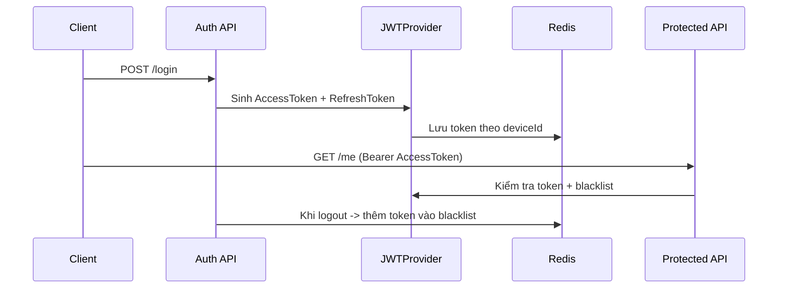

# AuthT — Authentication System with JWT, Redis & Blacklist

## Giới thiệu  
**AuthT** là hệ thống xác thực người dùng xây dựng bằng **Spring Boot**, sử dụng **JWT**, **Redis**, và **Blacklist** để quản lý đăng nhập đa thiết bị.  
Dự án mô phỏng cơ chế đăng nhập hiện đại tương tự các ứng dụng như Zalo, Facebook, Gmail,...

---

## Công nghệ sử dụng  
- **Backend:** Spring Boot 3.x  
- **Database:** MySQL  
- **Cache & Session Storage:** Redis  
- **Security:** Spring Security, JWT  
- **OAuth2 Login:** Google  
- **Build Tool:** Maven  
- **Logging:** SLF4J + Logback  

---

## Tính năng chính  

### Đăng ký & Đăng nhập  
- Hỗ trợ đăng nhập bằng **username/email + password**.  
- Sau khi đăng nhập, hệ thống sinh ra:
  - `AccessToken` (hết hạn sau 15 phút)  
  - `RefreshToken` (hết hạn sau 7 ngày)  

### Lưu token trong Redis  
- Token được lưu với key:
  ```
  access:{userId}:{deviceId}
  refresh:{userId}:{deviceId}
  ```
- `deviceId` được lấy từ header `User-Agent` (hoặc thông tin thiết bị client).  

### Blacklist (Thu hồi token)  
- Khi logout, token hiện tại được thêm vào **Blacklist** trong Redis.  
- Token trong Blacklist sẽ bị từ chối truy cập, dù chưa hết hạn.  
- Hỗ trợ:
  - `/logout` — đăng xuất khỏi thiết bị hiện tại  
  - `/logout-all` — đăng xuất khỏi tất cả thiết bị  

### Refresh Token  
- Khi `AccessToken` hết hạn, client có thể gọi API làm mới bằng `RefreshToken`.  
- Token cũ sẽ bị rotate và thay bằng token mới.  
- Nếu `RefreshToken` hết hạn hoặc bị thu hồi → buộc đăng nhập lại.  

### Đăng nhập qua Google (OAuth2)  
- Hỗ trợ đăng nhập bằng tài khoản Google OAuth2.  
- Sau khi xác thực thành công, hệ thống tự sinh JWT và lưu vào Redis tương tự đăng nhập thường.  

---

## Cấu trúc thư mục chính  

```
src/
 ├── main/java/com/example/auth
 │   ├── config/           # Cấu hình Security, JWT, Redis, OAuth2
 │   ├── controllers/      # Các REST API (AuthController, OAuth2Controller,...)
 │   ├── exceptions/       # Xử lý lỗi (GlobalExceptionHandler)
 │   ├── models/           # Entity, DTO, Request, Response
 │   ├── repositories/     # Data layer (UserRepository,...)
 │   ├── services/         # Business logic (AuthService, TokenService,...)
 │   └── utils/            # JWTProvider, Redis utilities
 └── resources/
     └── application.yml
```

---

## Hướng dẫn test bằng Postman  

### Login  
**POST** `/api/auth/login`  
**Headers:**
```
Content-Type: application/json
User-Agent: Postman/DeviceA
```
**Body:**
```json
{
  "usernameOrEmail": "admin",
  "password": "123456"
}
```

### Giả lập 2 thiết bị  
- Tạo **2 environment** trong Postman:  
  - `DeviceA`: `User-Agent = Postman/DeviceA`  
  - `DeviceB`: `User-Agent = Postman/DeviceB`  
→ Mỗi environment login sẽ sinh token riêng biệt trong Redis.

### Logout  
**POST** `/api/auth/logout`  
**Headers:**
```
Authorization: Bearer <access_token>
User-Agent: Postman/DeviceA
```

### Logout All  
**POST** `/api/auth/logout-all`  
**Headers:**
```
Authorization: Bearer <access_token>
```

---

## Redis Key Format  
```
access:{userId}:{deviceId}     → Access token theo thiết bị (TTL: 15 phút)
refresh:{userId}:{deviceId}    → Refresh token theo thiết bị (TTL: 7 ngày)
blacklist:{type}:{userId}:{deviceId} → Token bị thu hồi (TTL = thời gian còn lại)
```

---

## Flow hoạt động  



---

## Cài đặt & chạy thử  

```bash
# Clone project
git clone https://github.com/tangtuan16/AuthT.git
cd AuthT

# Cấu hình Redis (có thể dùng Docker)
docker run --name redis -p 6379:6379 -d redis

# Cấu hình database trong application.yml
# Sau đó chạy:
mvn spring-boot:run
```

---

## 👨‍💻 Tác giả  
**Tuan Tang**  
GitHub: [tangtuan16](https://github.com/tangtuan16)  
Repo: [AuthT](https://github.com/tangtuan16/AuthT)

---
